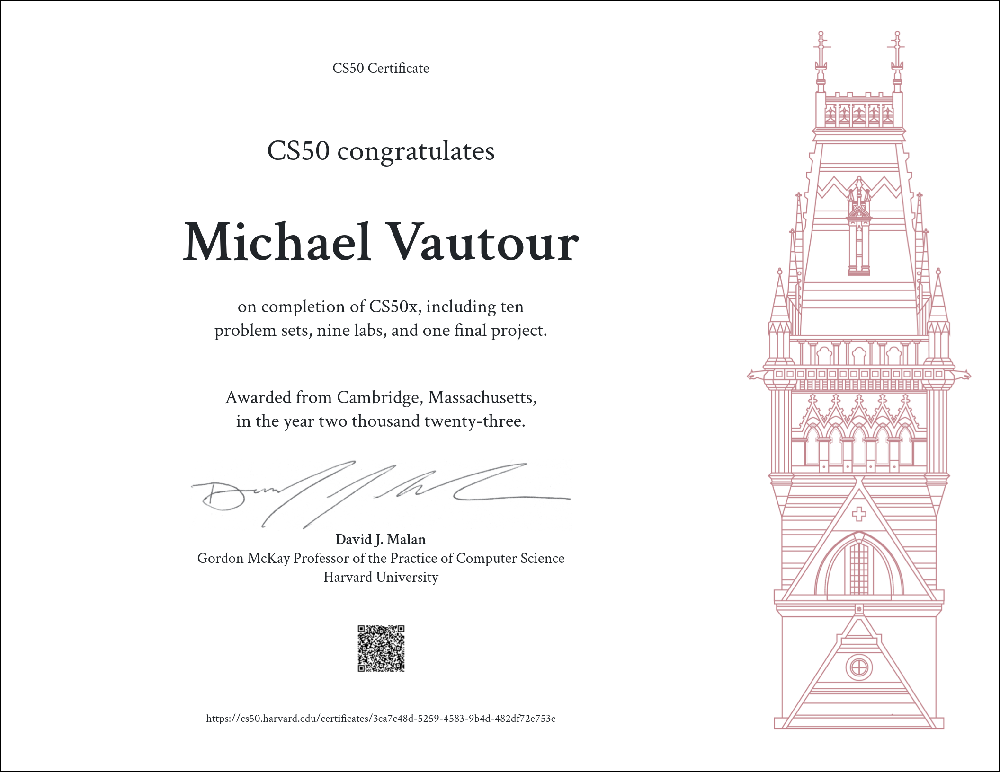

# Full Stack Open
Completed ~250 hours of training and coursework.

#### Certficate for the main course (7 Modules)

#### Certficate for FullStackOpen - GraphQL - Additional Module

#### Certficate for FullStackOpen - TypeScript - Additional Module

#### Certficate for FullStackOpen - React Native - Additional Module

#### Certficate for FullStackOpen - CI/CD - Additional Module

#### Certficate for FullStackOpen - Containers - Additional Module

#### Certficate for FullStackOpen - Using Relational Databases - Additional Module

## Links to certificates for verification:

### Full Stack Open Main Course:

- https://studies.cs.helsinki.fi/stats/api/certificate/fullstackopen/en/b5c4d777afdebf51ac77fc5aee208f3e

### Additional Modules:

- GraphQL - https://studies.cs.helsinki.fi/stats/api/certificate/fs-graphql/en/4343de760a9c8cf5b6c52ff4ede0dd8d
- TypeScript - https://studies.cs.helsinki.fi/stats/api/certificate/fs-typescript/en/c90d32acb7aadc6e4e5edf98e5566c58
- ReactNative - https://studies.cs.helsinki.fi/stats/api/certificate/fs-react-native-2020/en/7315839a44a483011f6c4b7ff268c561
- CI/CD - https://studies.cs.helsinki.fi/stats/api/certificate/fs-cicd/en/d27428a857e7729f09d0996b1a71e4d8
- Containers (docker dev and production environments) - https://studies.cs.helsinki.fi/stats/api/certificate/fs-containers/en/726d10351c3c8fab35c0f05f9443ee4c
- Using relational databases (ExpressJS api with Sequelize - PostgreSQL) - https://studies.cs.helsinki.fi/stats/api/certificate/fs-psql/en/d60b70ec926305eca38d6ced96effadd

# CS50: Introduction to Computer Science | Harvard University / Edx

From CS50 Website:
This is CS50x , Harvard University's introduction to the intellectual enterprises of computer science and the art of programming for majors and non-majors alike, with or without prior programming experience. An entry-level course taught by David J. Malan, CS50x teaches students how to think algorithmically and solve problems efficiently. Topics include abstraction, algorithms, data structures, encapsulation, resource management, security, software engineering, and web development. Languages include C, Python, SQL, and JavaScript plus CSS and HTML. Problem sets inspired by real-world domains of biology, cryptography, finance, forensics, and gaming. The on-campus version of CS50x , CS50, is Harvard's largest course. 

Students who earn a satisfactory score on 9 problem sets (i.e., programming assignments) and a final project are eligible for a certificate. This is a self-paced course–you may take CS50x on your own schedule.

Link to certificate for verification: https://cs50.harvard.edu/certificates/3ca7c48d-5259-4583-9b4d-482df72e753e

# Scrimba Frontend Developer Path
Completed 70 hours of training along with ~ 40 hours of solo projects and challenges covering basic to advances use of:
- HTML
- CSS
- Javascript ES6
- React Functional and Class Components, Higher order Components
- React Router
- Asynchronous Javascript and Api's

Link to certificate for verification: https://scrimba.com/certificate/u2Nne9UY/gfrontend
